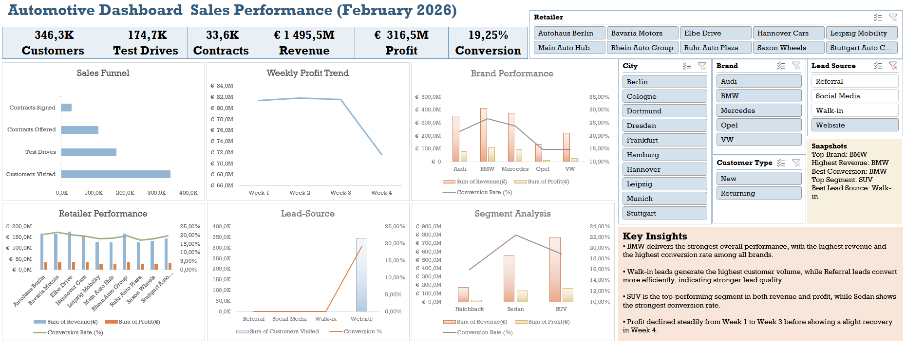
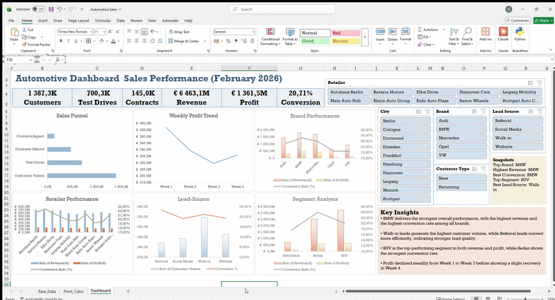

# 🚗 Automotive Sales Performance Dashboard (Excel)

## 📊 Overview

This project presents an interactive **Automotive Sales Dashboard** built in Microsoft Excel to analyze dealership performance across Germany for **February 2026**.

The dashboard provides insights into **sales funnel efficiency, brand performance, retailer effectiveness, lead source quality, and vehicle segment trends**, enabling data-driven decision-making for automotive sales teams.

---

## 🖼️ Dashboard Preview



---

## 📈 Top-Level KPIs (February 2026)

| Metric | Value |
|---|---|
| 👥 Customers Visited | 346,3K |
| 🚗 Test Drives | 174,7K |
| 📝 Contracts Signed | 33,6K |
| 💶 Revenue | € 1.495,5M |
| 💰 Profit | € 316,5M |
| 🎯 Conversion Rate | 19,25% |

---

## 🎯 Key Features

- 📈 **KPI Tracking**
  - Customers Visited, Test Drives, Contracts Signed
  - Total Revenue & Profit
  - Overall Conversion Rate

- 🔽 **Sales Funnel Analysis**
  - Tracks drop-off across four stages: Customers Visited → Test Drives → Contracts Offered → Contracts Signed
  - Identifies bottlenecks in the sales process

- 🚗 **Brand Performance**
  - Revenue, Profit, and Conversion Rate comparison across **Audi, BMW, Mercedes, Opel, and VW**
  - Highlights premium vs. volume brand strategy

- 📅 **Weekly Profit Trend**
  - Week-over-week profit tracking across the full month (Week 1–4)
  - Reveals trend direction and performance dips

- 🏢 **Retailer Performance**
  - Compares Revenue, Profit, and Conversion Rate across 10 dealerships:
    Autohaus Berlin, Bavaria Motors, Elbe Drive, Hannover Cars, Leipzig Mobility, Main Auto Hub, Rhein Auto Group, Ruhr Auto Plaza, Saxon Wheels, Stuttgart Auto C.

- 🎯 **Lead Source Analysis**
  - Compares customer volume and conversion rate across: **Referral, Social Media, Walk-in, Website**
  - Evaluates lead quality vs. quantity

- 🚙 **Segment Analysis**
  - Compares Revenue, Profit, and Conversion Rate across **Hatchback, Sedan, and SUV** segments

- 🎛️ **Interactive Filters (Slicers)**
  - **City:** Berlin, Cologne, Dortmund, Dresden, Frankfurt, Hamburg, Hannover, Leipzig, Munich, Stuttgart
  - **Brand:** Audi, BMW, Mercedes, Opel, VW
  - **Lead Source:** Referral, Social Media, Walk-in, Website
  - **Customer Type:** New, Returning
  - **Retailer:** All 10 dealerships

## 🎥 Dashboard Demo

---

## 💡 Key Insights

- **BMW** delivers the strongest overall performance, with the highest revenue and the highest conversion rate among all brands.
- **Walk-in** leads generate the highest customer volume, while **Referral** leads convert more efficiently, indicating stronger lead quality.
- **SUV** is the top-performing segment in both revenue and profit, while **Sedan** shows the strongest conversion rate.
- Profit declined steadily from **Week 1 to Week 3** before showing a slight recovery in Week 4.
- A noticeable drop-off exists between test drives and contracts signed, highlighting an opportunity to improve closing strategies.

---

## 🛠️ Tools & Techniques Used

- Microsoft Excel
- Pivot Tables & Pivot Charts
- Slicers (Interactive Filtering)
- Data Cleaning (`TRIM`, `CLEAN`, `SUBSTITUTE`)
- Custom Number Formatting (K / M format)
- Helper Calculations (Conversion Rate)
- Dashboard Design & Layout Principles

---

## 📁 Project Structure

```
automotive-sales-dashboard/
│
├── 📊 Automotive_Sales_Dashboard.xlsx   # Main Excel dashboard file
├── 📁 images/
│   └── dashboard_full.PNG               # Dashboard screenshot
└── 📄 README.md                         # Project documentation
```

---

## 🚀 How to Use

1. Download `Automotive_Sales_Dashboard.xlsx`
2. Open in **Microsoft Excel** (2016 or later recommended)
3. Use the **slicers** on the right panel to filter by City, Brand, Lead Source, Customer Type, or Retailer
4. All charts and KPIs update dynamically based on your selection

---

## 👤 Sushrut Narayan Singh

Built as a personal data analytics project to practice Excel dashboard design with real-world automotive sales scenarios.

---

## 📄 License

This project uses **dummy/simulated data** for demonstration purposes only. Feel free to fork and adapt for your own projects.
